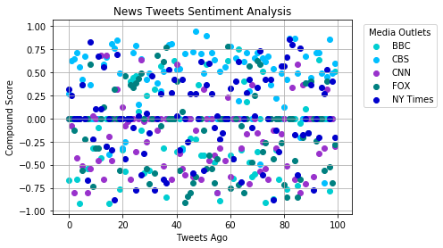
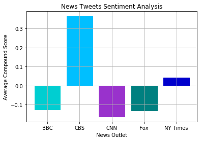

```python
#import dependencies
import tweepy
import numpy as np
import json
from datetime import datetime
import matplotlib.pyplot as plt
import pandas as pd 

# Import and Initialize Sentiment Analyzer
from vaderSentiment.vaderSentiment import SentimentIntensityAnalyzer
analyzer = SentimentIntensityAnalyzer()

# Twitter API Keys
from config import (consumer_key,
                    consumer_secret,
                    access_token,
                    access_token_secret)

# Setup Tweepy API Authentication
auth = tweepy.OAuthHandler(consumer_key, consumer_secret)
auth.set_access_token(access_token, access_token_secret)
api = tweepy.API(auth)
```


```python
#Create Empty lists for all tweet info

#Create array to record account for each tweet
account = []

# Create array to record all date-times of tweets
tweet_times = []

# Variables for holding sentiments
compound_score = []
positive_score = []
negative_score = []
neutral_score = []

#Create array to hold tweet text
tweets_text = []
```


```python
#BBC

# Target User
target_account = "bbcworld"

#Create empty list for bbc_compound score
bbc_compound = []

# Loop through 100 tweets
for status in tweepy.Cursor(api.user_timeline, id=target_account).items(100):
    tweet = status._json
    
    # Run Vader Analysis on each tweet
    results = analyzer.polarity_scores(tweet["text"])
    compound = results["compound"]
    pos = results["pos"]
    neu = results["neu"]
    neg = results["neg"]

    # Add each value to the appropriate list
    bbc_compound.append(compound)
    compound_score.append(compound)
    positive_score.append(pos)
    negative_score.append(neg)
    neutral_score.append(neu)
    
    # Store all tweet times into the array
    tweet_times.append(tweet["created_at"])
    tweets_text.append(tweet["text"])
    account.append("bbcworld")

# Create tweets_ago 
bbc_tweets_ago = range(len(bbc_compound))
```


```python
#CBS

# Target User
target_account = "cbs"

#Create empty list for cbs_compound score
cbs_compound = []

# Loop through last 100 tweets
for status in tweepy.Cursor(api.user_timeline, id=target_account).items(100):
    tweet = status._json
    
    # Run Vader Analysis on each tweet
    results = analyzer.polarity_scores(tweet["text"])
    compound = results["compound"]
    pos = results["pos"]
    neu = results["neu"]
    neg = results["neg"]

    # Add each value to the appropriate list
    cbs_compound.append(compound)
    compound_score.append(compound)
    positive_score.append(pos)
    negative_score.append(neg)
    neutral_score.append(neu)
    
    # Store all tweet times into the array
    tweet_times.append(tweet["created_at"])
    tweets_text.append(tweet["text"])
    account.append("cbs")

# Create tweets_ago 
cbs_tweets_ago = range(len(cbs_compound))
```


```python
#CNN

# Target User
target_account = "cnn"

#Create empty list for bbc_compound score
cnn_compound = []

# Loop through last 100 tweets
for status in tweepy.Cursor(api.user_timeline, id=target_account).items(100):
    tweet = status._json
    
    # Run Vader Analysis on each tweet
    results = analyzer.polarity_scores(tweet["text"])
    compound = results["compound"]
    pos = results["pos"]
    neu = results["neu"]
    neg = results["neg"]

    # Add each value to the appropriate list
    cnn_compound.append(compound)
    compound_score.append(compound)
    positive_score.append(pos)
    negative_score.append(neg)
    neutral_score.append(neu)
    
    # Store all tweet times into the array
    tweet_times.append(tweet["created_at"])
    tweets_text.append(tweet["text"])
    account.append("cnn")

# Create tweets_ago 
cnn_tweets_ago = range(len(cnn_compound))
```


```python
#pull last 100 tweets from FOX

# Target User
target_account = "foxnews"

#Create empty list for bbc_compound score
fox_compound = []

# Loop through 100 tweets
for status in tweepy.Cursor(api.user_timeline, id=target_account).items(100):
    tweet = status._json
    
    # Run Vader Analysis on each tweet
    results = analyzer.polarity_scores(tweet["text"])
    compound = results["compound"]
    pos = results["pos"]
    neu = results["neu"]
    neg = results["neg"]

    # Add each value to the appropriate list
    fox_compound.append(compound)
    compound_score.append(compound)
    positive_score.append(pos)
    negative_score.append(neg)
    neutral_score.append(neu)
    
    # Store all tweet times into the array
    tweet_times.append(tweet["created_at"])
    tweets_text.append(tweet["text"])
    account.append("foxnews")

# Create tweets_ago 
fox_tweets_ago = range(len(fox_compound))
```


```python
#pull last 100 tweets from New York TImes

# Target User
target_account = "nytimes"

#Create list for NY Times compound score 
ny_times_compound = []

# Loop through 100 tweets
for status in tweepy.Cursor(api.user_timeline, id=target_account).items(100):
    tweet = status._json
    
    # Run Vader Analysis on each tweet
    results = analyzer.polarity_scores(tweet["text"])
    compound = results["compound"]
    pos = results["pos"]
    neu = results["neu"]
    neg = results["neg"]

    # Add each score to the appropriate list
    ny_times_compound.append(compound)
    
    compound_score.append(compound)
    positive_score.append(pos)
    negative_score.append(neg)
    neutral_score.append(neu)
    #Add other tweet info to appropriate list
    tweet_times.append(tweet["created_at"])
    tweets_text.append(tweet["text"])
    account.append("nytimes")

# Create tweets_ago 
ny_tweets_ago = range(len(ny_times_compound))
```


```python
#Convert all tweet times into datetime objects
tweet_time_objects = []

# Add each datetime object into the array
for x in range(len(tweet_times)):
    tweet_datetime = datetime.strptime(tweet_times[x], "%a %b %d %H:%M:%S %z %Y")
    tweet_time_objects.append(tweet_datetime)
```


```python
# Make DataFrame with lists
News_twitter_info = pd.DataFrame(
    {'Account': account,
     'DateTime': tweet_times,
     'Compound Score': compound_score,
     'Positivity Score': positive_score,
     'Negativity Score': negative_score,
     'Neutral Score': neutral_score,
     'Text': tweets_text
    })

News_twitter_info.sort_values(by=['DateTime'])
```


<div>
<style scoped>
    .dataframe tbody tr th:only-of-type {
        vertical-align: middle;
    }

    .dataframe tbody tr th {
        vertical-align: top;
    }

    .dataframe thead th {
        text-align: right;
    }
</style>
<table border="1" class="dataframe">
  <thead>
    <tr style="text-align: right;">
      <th></th>
      <th>Account</th>
      <th>Compound Score</th>
      <th>DateTime</th>
      <th>Negativity Score</th>
      <th>Neutral Score</th>
      <th>Positivity Score</th>
      <th>Text</th>
    </tr>
  </thead>
  <tbody>
    <tr>
      <th>112</th>
      <td>cbs</td>
      <td>0.0000</td>
      <td>Fri Apr 06 13:45:00 +0000 2018</td>
      <td>0.000</td>
      <td>1.000</td>
      <td>0.000</td>
      <td>Do you have a question for country music legen...</td>
    </tr>
    <tr>
      <th>111</th>
      <td>cbs</td>
      <td>0.0000</td>
      <td>Fri Apr 06 17:00:00 +0000 2018</td>
      <td>0.000</td>
      <td>1.000</td>
      <td>0.000</td>
      <td>What’s @eltonofficial's birth name and which o...</td>
    </tr>
    <tr>
      <th>110</th>
      <td>cbs</td>
      <td>0.0000</td>
      <td>Fri Apr 06 21:10:18 +0000 2018</td>
      <td>0.000</td>
      <td>1.000</td>
      <td>0.000</td>
      <td>Ask 53rd ACM Awards® host @reba a question and...</td>
    </tr>
    <tr>
      <th>194</th>
      <td>cbs</td>
      <td>0.4939</td>
      <td>Fri Mar 02 18:45:00 +0000 2018</td>
      <td>0.000</td>
      <td>0.849</td>
      <td>0.151</td>
      <td>In honor of Women's History Month, CBS and the...</td>
    </tr>
    <tr>
      <th>193</th>
      <td>cbs</td>
      <td>0.7096</td>
      <td>Fri Mar 02 20:30:01 +0000 2018</td>
      <td>0.000</td>
      <td>0.718</td>
      <td>0.282</td>
      <td>Join @maria_bello, @aishatyler and @TeaLeoni i...</td>
    </tr>
    <tr>
      <th>192</th>
      <td>cbs</td>
      <td>0.7096</td>
      <td>Fri Mar 02 22:30:01 +0000 2018</td>
      <td>0.000</td>
      <td>0.753</td>
      <td>0.247</td>
      <td>Who are the trailblazing women in your life th...</td>
    </tr>
    <tr>
      <th>183</th>
      <td>cbs</td>
      <td>0.0000</td>
      <td>Fri Mar 09 16:02:27 +0000 2018</td>
      <td>0.000</td>
      <td>1.000</td>
      <td>0.000</td>
      <td>RT @BlueBloods_CBS: Even stand-up guys fall do...</td>
    </tr>
    <tr>
      <th>182</th>
      <td>cbs</td>
      <td>0.8658</td>
      <td>Fri Mar 09 18:27:28 +0000 2018</td>
      <td>0.000</td>
      <td>0.553</td>
      <td>0.447</td>
      <td>RT @thegoodfight: Smart, sexy, and sophisticat...</td>
    </tr>
    <tr>
      <th>181</th>
      <td>cbs</td>
      <td>0.4215</td>
      <td>Fri Mar 09 21:10:21 +0000 2018</td>
      <td>0.000</td>
      <td>0.823</td>
      <td>0.177</td>
      <td>Give a round of applause to @KelseaBallerini, ...</td>
    </tr>
    <tr>
      <th>180</th>
      <td>cbs</td>
      <td>0.1275</td>
      <td>Fri Mar 09 22:24:20 +0000 2018</td>
      <td>0.092</td>
      <td>0.795</td>
      <td>0.113</td>
      <td>RT @MomCBS: If you missed guest star @KChenowe...</td>
    </tr>
    <tr>
      <th>179</th>
      <td>cbs</td>
      <td>0.4926</td>
      <td>Fri Mar 09 22:48:26 +0000 2018</td>
      <td>0.000</td>
      <td>0.883</td>
      <td>0.117</td>
      <td>RT @DierksBentley: Take and post a photo of th...</td>
    </tr>
    <tr>
      <th>169</th>
      <td>cbs</td>
      <td>0.6514</td>
      <td>Fri Mar 16 16:28:40 +0000 2018</td>
      <td>0.000</td>
      <td>0.822</td>
      <td>0.178</td>
      <td>The games have just begun! Continue to stream ...</td>
    </tr>
    <tr>
      <th>168</th>
      <td>cbs</td>
      <td>0.0000</td>
      <td>Fri Mar 16 18:15:53 +0000 2018</td>
      <td>0.000</td>
      <td>1.000</td>
      <td>0.000</td>
      <td>RT @thegoodfight: Go behind the scenes with co...</td>
    </tr>
    <tr>
      <th>167</th>
      <td>cbs</td>
      <td>0.2960</td>
      <td>Fri Mar 16 22:53:21 +0000 2018</td>
      <td>0.000</td>
      <td>0.896</td>
      <td>0.104</td>
      <td>Stars @JakeMcDorman and Nik Dodani will join t...</td>
    </tr>
    <tr>
      <th>151</th>
      <td>cbs</td>
      <td>0.8997</td>
      <td>Fri Mar 23 22:32:48 +0000 2018</td>
      <td>0.000</td>
      <td>0.645</td>
      <td>0.355</td>
      <td>RT @HawaiiFive0CBS: Nothing like a man and his...</td>
    </tr>
    <tr>
      <th>150</th>
      <td>cbs</td>
      <td>0.4939</td>
      <td>Fri Mar 23 22:33:04 +0000 2018</td>
      <td>0.000</td>
      <td>0.686</td>
      <td>0.314</td>
      <td>RT @SEALTeamCBS: In honor of #NationalPuppyDay...</td>
    </tr>
    <tr>
      <th>149</th>
      <td>cbs</td>
      <td>0.6996</td>
      <td>Fri Mar 23 22:33:52 +0000 2018</td>
      <td>0.000</td>
      <td>0.806</td>
      <td>0.194</td>
      <td>Get ready for some sweet games! Stream #5 Clem...</td>
    </tr>
    <tr>
      <th>130</th>
      <td>cbs</td>
      <td>0.4926</td>
      <td>Fri Mar 30 16:50:00 +0000 2018</td>
      <td>0.000</td>
      <td>0.873</td>
      <td>0.127</td>
      <td>Take and post a photo of the woman in your lif...</td>
    </tr>
    <tr>
      <th>126</th>
      <td>cbs</td>
      <td>0.1513</td>
      <td>Mon Apr 02 17:30:00 +0000 2018</td>
      <td>0.092</td>
      <td>0.792</td>
      <td>0.116</td>
      <td>No one does it quite like @eltonofficial. The ...</td>
    </tr>
    <tr>
      <th>475</th>
      <td>nytimes</td>
      <td>0.4215</td>
      <td>Mon Apr 09 00:04:17 +0000 2018</td>
      <td>0.000</td>
      <td>0.865</td>
      <td>0.135</td>
      <td>Facebook's advice to Mark Zuckerberg as he pre...</td>
    </tr>
    <tr>
      <th>43</th>
      <td>bbcworld</td>
      <td>0.0000</td>
      <td>Mon Apr 09 00:10:28 +0000 2018</td>
      <td>0.000</td>
      <td>1.000</td>
      <td>0.000</td>
      <td>Bhutan's 'Shangri-La' caught between two rival...</td>
    </tr>
    <tr>
      <th>42</th>
      <td>bbcworld</td>
      <td>-0.3182</td>
      <td>Mon Apr 09 00:13:22 +0000 2018</td>
      <td>0.173</td>
      <td>0.827</td>
      <td>0.000</td>
      <td>Letter from Africa: The handshake that left mi...</td>
    </tr>
    <tr>
      <th>474</th>
      <td>nytimes</td>
      <td>0.0000</td>
      <td>Mon Apr 09 00:22:55 +0000 2018</td>
      <td>0.000</td>
      <td>1.000</td>
      <td>0.000</td>
      <td>Paleontologists have discovered dozens of jumb...</td>
    </tr>
    <tr>
      <th>473</th>
      <td>nytimes</td>
      <td>0.4215</td>
      <td>Mon Apr 09 00:40:49 +0000 2018</td>
      <td>0.000</td>
      <td>0.865</td>
      <td>0.135</td>
      <td>Facebook's advice to Mark Zuckerberg as he pre...</td>
    </tr>
    <tr>
      <th>472</th>
      <td>nytimes</td>
      <td>-0.6124</td>
      <td>Mon Apr 09 00:43:09 +0000 2018</td>
      <td>0.267</td>
      <td>0.733</td>
      <td>0.000</td>
      <td>A Town That Lives for Hockey Is Devastated by ...</td>
    </tr>
    <tr>
      <th>471</th>
      <td>nytimes</td>
      <td>0.7351</td>
      <td>Mon Apr 09 00:57:20 +0000 2018</td>
      <td>0.000</td>
      <td>0.725</td>
      <td>0.275</td>
      <td>The snow monkeys of Japan like a nice warm bat...</td>
    </tr>
    <tr>
      <th>470</th>
      <td>nytimes</td>
      <td>0.3400</td>
      <td>Mon Apr 09 01:03:51 +0000 2018</td>
      <td>0.000</td>
      <td>0.821</td>
      <td>0.179</td>
      <td>North Korea Said to Offer Direct Assurance It ...</td>
    </tr>
    <tr>
      <th>469</th>
      <td>nytimes</td>
      <td>0.0258</td>
      <td>Mon Apr 09 01:20:33 +0000 2018</td>
      <td>0.000</td>
      <td>0.939</td>
      <td>0.061</td>
      <td>Many people taking antidepressants are saying ...</td>
    </tr>
    <tr>
      <th>41</th>
      <td>bbcworld</td>
      <td>0.0000</td>
      <td>Mon Apr 09 01:35:39 +0000 2018</td>
      <td>0.000</td>
      <td>1.000</td>
      <td>0.000</td>
      <td>Facebook data: How it was used by Cambridge An...</td>
    </tr>
    <tr>
      <th>468</th>
      <td>nytimes</td>
      <td>-0.1027</td>
      <td>Mon Apr 09 01:39:49 +0000 2018</td>
      <td>0.188</td>
      <td>0.680</td>
      <td>0.132</td>
      <td>Michigan will stop providing free bottled wate...</td>
    </tr>
    <tr>
      <th>...</th>
      <td>...</td>
      <td>...</td>
      <td>...</td>
      <td>...</td>
      <td>...</td>
      <td>...</td>
      <td>...</td>
    </tr>
    <tr>
      <th>171</th>
      <td>cbs</td>
      <td>-0.4939</td>
      <td>Thu Mar 15 17:20:26 +0000 2018</td>
      <td>0.157</td>
      <td>0.766</td>
      <td>0.077</td>
      <td>RT @instinctcbs: Dr. Dylan Reinhart is lured b...</td>
    </tr>
    <tr>
      <th>170</th>
      <td>cbs</td>
      <td>0.7088</td>
      <td>Thu Mar 15 17:54:06 +0000 2018</td>
      <td>0.000</td>
      <td>0.763</td>
      <td>0.237</td>
      <td>RT @TheTalkCBS: You asked, we answered! The fu...</td>
    </tr>
    <tr>
      <th>154</th>
      <td>cbs</td>
      <td>0.6360</td>
      <td>Thu Mar 22 00:23:38 +0000 2018</td>
      <td>0.000</td>
      <td>0.802</td>
      <td>0.198</td>
      <td>Congratulations to all of the @CBSDaytime nomi...</td>
    </tr>
    <tr>
      <th>153</th>
      <td>cbs</td>
      <td>0.7081</td>
      <td>Thu Mar 22 20:52:02 +0000 2018</td>
      <td>0.066</td>
      <td>0.623</td>
      <td>0.311</td>
      <td>Save the date! These are season finales you do...</td>
    </tr>
    <tr>
      <th>152</th>
      <td>cbs</td>
      <td>0.0000</td>
      <td>Thu Mar 22 22:10:29 +0000 2018</td>
      <td>0.000</td>
      <td>1.000</td>
      <td>0.000</td>
      <td>Game on! 16 teams left and the race to the fin...</td>
    </tr>
    <tr>
      <th>132</th>
      <td>cbs</td>
      <td>0.0000</td>
      <td>Thu Mar 29 17:30:02 +0000 2018</td>
      <td>0.000</td>
      <td>1.000</td>
      <td>0.000</td>
      <td>Will @HIGHVALLEY, @LancoMusic, @LOCASHmusic, @...</td>
    </tr>
    <tr>
      <th>131</th>
      <td>cbs</td>
      <td>0.0000</td>
      <td>Thu Mar 29 17:32:40 +0000 2018</td>
      <td>0.000</td>
      <td>1.000</td>
      <td>0.000</td>
      <td>Expect epic performances by @kanebrown , @kell...</td>
    </tr>
    <tr>
      <th>125</th>
      <td>cbs</td>
      <td>0.7906</td>
      <td>Tue Apr 03 05:17:01 +0000 2018</td>
      <td>0.000</td>
      <td>0.579</td>
      <td>0.421</td>
      <td>Tonight we #LightItUpBlue for greater understa...</td>
    </tr>
    <tr>
      <th>124</th>
      <td>cbs</td>
      <td>0.7096</td>
      <td>Tue Apr 03 18:00:00 +0000 2018</td>
      <td>0.000</td>
      <td>0.742</td>
      <td>0.258</td>
      <td>In just one week, @eltonofficial and today's h...</td>
    </tr>
    <tr>
      <th>123</th>
      <td>cbs</td>
      <td>0.0000</td>
      <td>Tue Apr 03 21:00:02 +0000 2018</td>
      <td>0.000</td>
      <td>1.000</td>
      <td>0.000</td>
      <td>Here's everything you need to know before tuni...</td>
    </tr>
    <tr>
      <th>122</th>
      <td>cbs</td>
      <td>0.0000</td>
      <td>Tue Apr 03 23:00:00 +0000 2018</td>
      <td>0.000</td>
      <td>1.000</td>
      <td>0.000</td>
      <td>Whose catchy tune will take Song Of The Year a...</td>
    </tr>
    <tr>
      <th>188</th>
      <td>cbs</td>
      <td>0.6705</td>
      <td>Tue Mar 06 18:10:59 +0000 2018</td>
      <td>0.000</td>
      <td>0.756</td>
      <td>0.244</td>
      <td>Meet the ensemble of talented actors slated to...</td>
    </tr>
    <tr>
      <th>176</th>
      <td>cbs</td>
      <td>0.5390</td>
      <td>Tue Mar 13 14:15:10 +0000 2018</td>
      <td>0.000</td>
      <td>0.821</td>
      <td>0.179</td>
      <td>Music stars @MileyCyrus, @edsheeran, @ladygaga...</td>
    </tr>
    <tr>
      <th>175</th>
      <td>cbs</td>
      <td>0.3612</td>
      <td>Tue Mar 13 18:48:52 +0000 2018</td>
      <td>0.000</td>
      <td>0.857</td>
      <td>0.143</td>
      <td>RT @ManWithAPlan: Hungry for more #ManWithAPla...</td>
    </tr>
    <tr>
      <th>159</th>
      <td>cbs</td>
      <td>0.0000</td>
      <td>Tue Mar 20 16:11:00 +0000 2018</td>
      <td>0.000</td>
      <td>1.000</td>
      <td>0.000</td>
      <td>Country superstars @kennychesney, @ladyantebel...</td>
    </tr>
    <tr>
      <th>158</th>
      <td>cbs</td>
      <td>0.5562</td>
      <td>Tue Mar 20 16:52:42 +0000 2018</td>
      <td>0.000</td>
      <td>0.826</td>
      <td>0.174</td>
      <td>RT @ladyantebellum: Ecstatic to announce we'll...</td>
    </tr>
    <tr>
      <th>157</th>
      <td>cbs</td>
      <td>0.0000</td>
      <td>Tue Mar 20 17:58:43 +0000 2018</td>
      <td>0.000</td>
      <td>1.000</td>
      <td>0.000</td>
      <td>RT @nancyodell: Told my daughter I'd be presen...</td>
    </tr>
    <tr>
      <th>156</th>
      <td>cbs</td>
      <td>0.5106</td>
      <td>Tue Mar 20 20:00:01 +0000 2018</td>
      <td>0.000</td>
      <td>0.858</td>
      <td>0.142</td>
      <td>The legendary @Reba returns to host the 53rd #...</td>
    </tr>
    <tr>
      <th>134</th>
      <td>cbs</td>
      <td>0.2960</td>
      <td>Tue Mar 27 17:00:00 +0000 2018</td>
      <td>0.000</td>
      <td>0.901</td>
      <td>0.099</td>
      <td>Join @eltonofficial and some of today's hottes...</td>
    </tr>
    <tr>
      <th>133</th>
      <td>cbs</td>
      <td>0.3818</td>
      <td>Tue Mar 27 21:00:01 +0000 2018</td>
      <td>0.108</td>
      <td>0.680</td>
      <td>0.212</td>
      <td>Count on Entertainer Of The Year nominee @Luke...</td>
    </tr>
    <tr>
      <th>121</th>
      <td>cbs</td>
      <td>-0.2500</td>
      <td>Wed Apr 04 18:02:13 +0000 2018</td>
      <td>0.133</td>
      <td>0.867</td>
      <td>0.000</td>
      <td>RT @TVLine: #LifeInPieces Sneak Peek: Sophia a...</td>
    </tr>
    <tr>
      <th>120</th>
      <td>cbs</td>
      <td>-0.3182</td>
      <td>Wed Apr 04 21:44:17 +0000 2018</td>
      <td>0.095</td>
      <td>0.905</td>
      <td>0.000</td>
      <td>RT @survivorcbs: There's a lot at stake when c...</td>
    </tr>
    <tr>
      <th>119</th>
      <td>cbs</td>
      <td>0.4926</td>
      <td>Wed Apr 04 21:46:13 +0000 2018</td>
      <td>0.000</td>
      <td>0.803</td>
      <td>0.197</td>
      <td>RT @MomCBS: Tomorrow's episode of #Mom is goin...</td>
    </tr>
    <tr>
      <th>118</th>
      <td>cbs</td>
      <td>0.8495</td>
      <td>Wed Apr 04 21:47:26 +0000 2018</td>
      <td>0.000</td>
      <td>0.634</td>
      <td>0.366</td>
      <td>RT @YoungSheldon: Don't miss guest star @Follo...</td>
    </tr>
    <tr>
      <th>117</th>
      <td>cbs</td>
      <td>0.7568</td>
      <td>Wed Apr 04 21:48:07 +0000 2018</td>
      <td>0.000</td>
      <td>0.712</td>
      <td>0.288</td>
      <td>RT @LifeInPiecesCBS: We "literally can't even"...</td>
    </tr>
    <tr>
      <th>116</th>
      <td>cbs</td>
      <td>0.8070</td>
      <td>Wed Apr 04 22:07:01 +0000 2018</td>
      <td>0.000</td>
      <td>0.687</td>
      <td>0.313</td>
      <td>Today's biggest stars are celebrating @EltonJo...</td>
    </tr>
    <tr>
      <th>187</th>
      <td>cbs</td>
      <td>0.0000</td>
      <td>Wed Mar 07 17:06:02 +0000 2018</td>
      <td>0.000</td>
      <td>1.000</td>
      <td>0.000</td>
      <td>This just in! @Jason_Aldean, @mirandalambert, ...</td>
    </tr>
    <tr>
      <th>186</th>
      <td>cbs</td>
      <td>-0.2023</td>
      <td>Wed Mar 07 18:39:10 +0000 2018</td>
      <td>0.230</td>
      <td>0.619</td>
      <td>0.150</td>
      <td>RT @thegoodfight: Meticulously constructed. So...</td>
    </tr>
    <tr>
      <th>174</th>
      <td>cbs</td>
      <td>0.6696</td>
      <td>Wed Mar 14 19:30:01 +0000 2018</td>
      <td>0.000</td>
      <td>0.781</td>
      <td>0.219</td>
      <td>Give these ladies some love! @Lauren_Alaina, @...</td>
    </tr>
    <tr>
      <th>155</th>
      <td>cbs</td>
      <td>0.0000</td>
      <td>Wed Mar 21 18:00:01 +0000 2018</td>
      <td>0.000</td>
      <td>1.000</td>
      <td>0.000</td>
      <td>Female Vocalist Of The Year nominee @MarenMorr...</td>
    </tr>
  </tbody>
</table>
<p>500 rows × 7 columns</p>
</div>


```python
#export dataframe into csv file
output_fn = "News_Tweet_Info.csv"
News_twitter_info.to_csv(output_fn)
```


```python
#Make scatterplot showing compound score (use dif. color per news outlet)
colors = {'bbcworld' : 'darkturquoise',
          'cbs' : 'deepskyblue',
          'cnn' : 'aquamarine',
          'foxnews' : 'teal',
          'nytimes': 'mediumblue'}
c = [colors[val] for val in News_twitter_info['Account']]

bbc = plt.scatter(bbc_tweets_ago, bbc_compound, color='darkturquoise')
cbs = plt.scatter(cbs_tweets_ago, cbs_compound, color='deepskyblue')
cnn = plt.scatter(cnn_tweets_ago, cnn_compound, color='darkorchid')
fox = plt.scatter(fox_tweets_ago, fox_compound, color='teal')
nytimes = plt.scatter(ny_tweets_ago, ny_times_compound, color='mediumblue')

#Chart Aesthetics
plt.xlabel("Tweets Ago")
plt.ylabel("Compound Score")
plt.title("News Tweets Sentiment Analysis")
plt.grid()

# Add legend
plt.legend((bbc, cbs, cnn, fox, nytimes),
           ("BBC", "CBS", "CNN", "FOX", "NY Times"), 
           title="Media Outlets", loc="upper right", bbox_to_anchor=(1.3,1))

# Save and show chart
plt.savefig("sentiment_scatter.png")
plt.show()

```





```python
# Calculate Averages of the following: "compound score" for each outlet
average_compound = []

# See "Create DataFrame" below for the variable names you should use
average_compound.append(np.mean(bbc_compound))
average_compound.append(np.mean(cbs_compound))
average_compound.append(np.mean(cnn_compound))
average_compound.append(np.mean(fox_compound))
average_compound.append(np.mean(ny_times_compound))

Account = ["BBC", "CBS", "CNN", "Fox", "NY Times"]

# Create DataFrame
averages = pd.DataFrame(
    {"Account": Account, 
     "Average Compound Score": average_compound
    })

# Create a Dataframe of the averages
#averages_df = pd.DataFrame(averages)
#averages_df.head()
averages
```


<div>
<style scoped>
    .dataframe tbody tr th:only-of-type {
        vertical-align: middle;
    }

    .dataframe tbody tr th {
        vertical-align: top;
    }

    .dataframe thead th {
        text-align: right;
    }
</style>
<table border="1" class="dataframe">
  <thead>
    <tr style="text-align: right;">
      <th></th>
      <th>Account</th>
      <th>Average Compound Score</th>
    </tr>
  </thead>
  <tbody>
    <tr>
      <th>0</th>
      <td>BBC</td>
      <td>-0.125149</td>
    </tr>
    <tr>
      <th>1</th>
      <td>CBS</td>
      <td>0.363949</td>
    </tr>
    <tr>
      <th>2</th>
      <td>CNN</td>
      <td>-0.162566</td>
    </tr>
    <tr>
      <th>3</th>
      <td>Fox</td>
      <td>-0.129913</td>
    </tr>
    <tr>
      <th>4</th>
      <td>NY Times</td>
      <td>0.041229</td>
    </tr>
  </tbody>
</table>
</div>


```python
#Make Average Compound Score bar Graph
Average_Compound_plot = plt.bar(Account, average_compound)
my_colors = 'rgbkymc'
Average_Compound_plot[0].set_color('darkturquoise')
Average_Compound_plot[1].set_color('deepskyblue')
Average_Compound_plot[2].set_color('darkorchid')
Average_Compound_plot[3].set_color('teal')
Average_Compound_plot[4].set_color('mediumblue')

#plot aesthetics 
plt.xlabel("News Outlet")
plt.ylabel("Average Compound Score")
plt.title("News Tweets Sentiment Analysis")
plt.grid()

# Save and show chart
plt.savefig("sentiment_bar.png")
plt.show()
```




